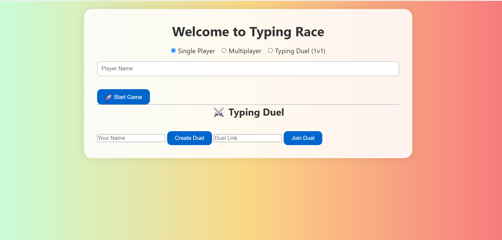
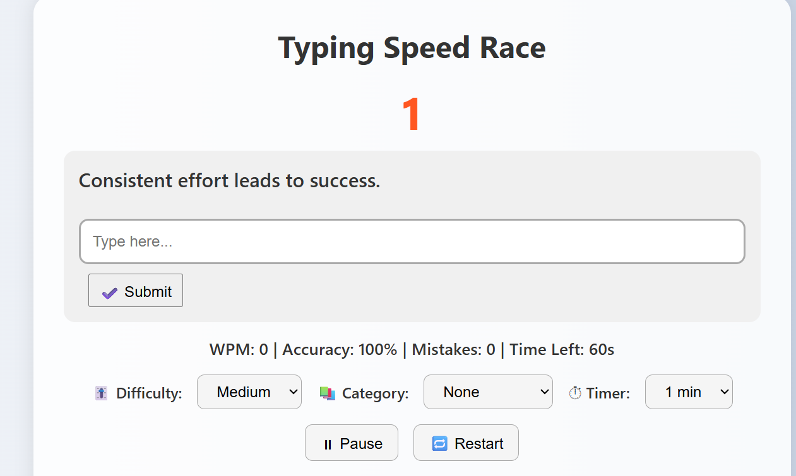
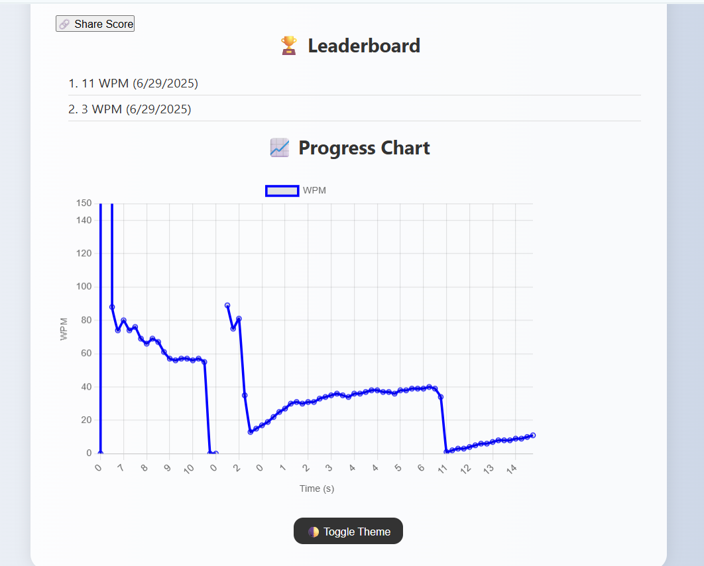
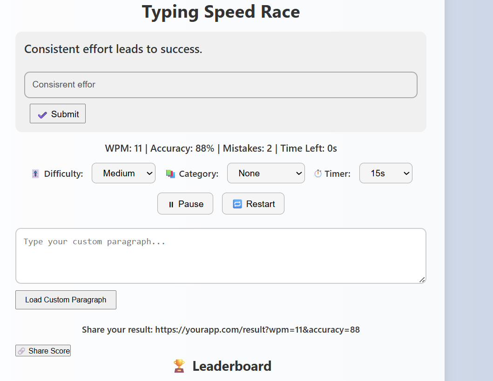
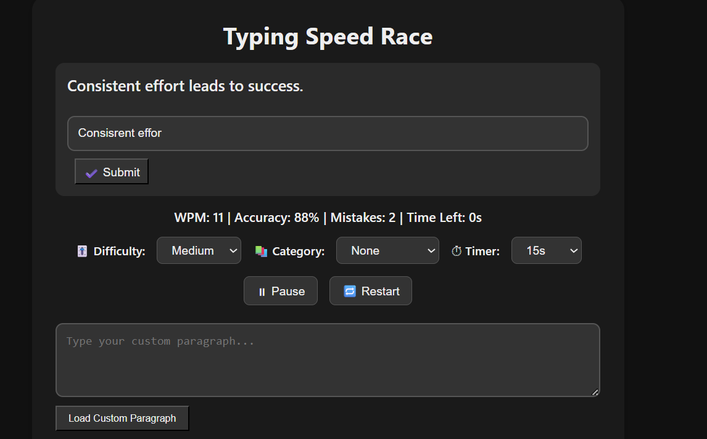

# 🚀 Typing Speed Test App

Welcome to the **Typing Speed Test App** — a fast, fun, and feature-packed web application to test and improve your typing speed.

🌐 **Live Demo:** [Click Here to Try It!](https://typing-race-scza.onrender.com)

---

## ✨ Features

### ✅ Core Typing Game Features
- ⌨️ Typing speed test with real-time **WPM** & **accuracy**
- ⏱ Timer options: 15s, 30s, 60s, 120s
- ❌ Mistake tracking
- 📊 Progress chart (Chart.js)
- 🏆 Leaderboard (stored using localStorage)

### 🎮 Game Modes
- 👤 Single Player Mode
- 🤝 Multiplayer Mode (Socket.io)
- ⚔️ Typing Duel (1v1 via shareable link)

### 📚 Content Modes
- 📖 Quotes
- 📜 Paragraphs
- 📰 News
- 🧠 Vocabulary
- 🎚️ Easy / Medium / Hard difficulties

### 🧠 Extra Functionalities
- 🌗 Light / Dark theme toggle
- 🔁 Restart and ⏸ Pause/▶️ Resume options
- 🧾 Custom Test Mode (User types their own paragraph)
- 🔗 Shareable result links with WPM and accuracy
- 🎉 Confetti animation for winners
- 📱 Fully responsive for mobile and desktop

---

## 🖼️ Screenshots

### 🏁 Welcome Page


### ⌨️ Game Start


### ⌨️ Typing In Progress


### 🏆 Game Over


### 📈 Progress Chart


---

## 🛠️ Local Setup Instructions

1. **Clone the Repository**

```bash
git clone https://github.com/SaiPriya0606/typing-speed-test.git
cd typing-speed-test

2. Install Dependencies
npm install

3. Start the Server
node server.js

Then open: http://localhost:3000


🚀 Deployment
This app is hosted on Render.
Live URL: https://typing-race-scza.onrender.com

📁 Folder Structure
typing-race/
├── node_modules/
├── public/
│   ├── index.html
│   ├── welcome.html
│   ├── main.js
│   └── style.css
├── Screenshots/
│   ├── welcome.png
│   ├── index1.png
│   ├── index2.png
│   ├── index3.png
│   └── index4.png
├── server.js
├── package.json
├── package-lock.json
├── .gitignore
└── README.md

🙋‍♀️ Author
👩‍💻 Sai Priya
📫 GitHub Profile-https://github.com/SaiPriya0606

⭐ Support
If you found this useful, consider giving it a ⭐ on GitHub-https://github.com/SaiPriya0606!


✅ After adding the screenshots and this `README.md`, run:


git add README.md Screenshots/
git commit -m "📝 Added full README with screenshots"
git push

