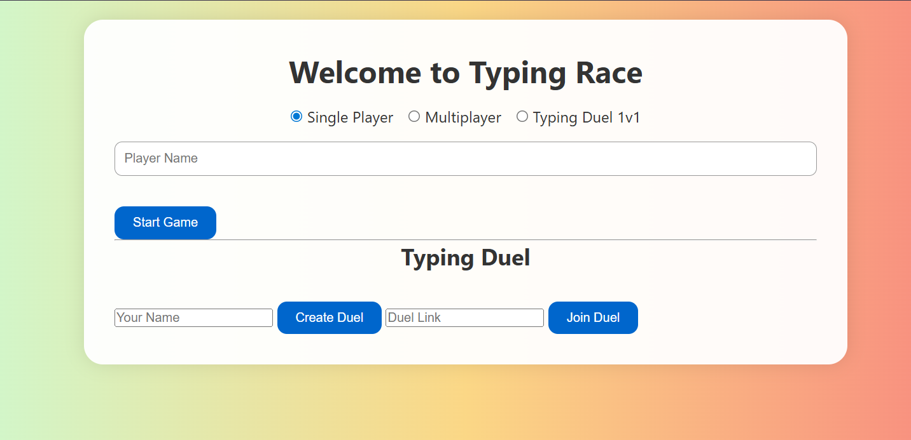

# 🚀 Typing Speed Race 🏎️💨

A real-time typing speed racing game where players can practice solo or compete with others online.  
Track **WPM**, **accuracy**, and **progress charts** while improving typing skills in a fun, interactive way.

  
  
  
  

  

---

## 🚀 Live Demo

🔗 **Live URL:**  
👉 https://typing-speed-test-9s3o.onrender.com  

📝 App opens with a **Welcome Page**, then redirects to the game after mode selection.

---

## 🧭 Application Flow

1. App opens on the **Welcome Page** (`/`)
2. Player selects:
   - Game mode (Solo / Multiplayer / Typing Duel)
   - Player name(s)
3. On start, user is redirected to:
   - `/game` → Main typing race interface
4. Countdown begins
5. Player types the displayed text
6. WPM, accuracy, and mistakes update in real-time
7. In multiplayer:
   - Live leaderboard updates
   - Winner is announced automatically 🎉

---

## 🌐 Routes

| Route | Description |
|------|-------------|
| `/` | Welcome & mode selection page |
| `/game` | Main typing race game |
| `*` | Redirects to welcome page |

---

## ✨ Features

### 🎯 Core Typing Game
- Real-time **WPM** calculation  
- **Accuracy & mistake tracking**  
- Countdown before race start  
- ENTER key support to submit text  
- Auto-load next sentence  
- Timer options: **15s, 30s, 60s, 120s**  
- Progress chart using **Chart.js**  
- Local leaderboard using **LocalStorage**

### 🎮 Multiplayer (Socket.io)
- Global multiplayer rooms  
- Private duel rooms  
- Live WPM leaderboard per room  
- Automatic **winner announcement**
- Confetti celebration 🎉

### 📝 Content Modes
- Difficulty levels: **Easy | Medium | Hard**
- Content types:
  - Quotes
  - Paragraphs
  - News
  - Vocabulary
- Custom paragraph typing support

### 🌟 UI & UX
- Welcome page with mode selection
2️⃣ Install dependencies
npm install
3️⃣ Start the server
npm start

🌐 Open in browser:
👉 http://localhost:3000

(Default opens Welcome Page)

🏗️ Project Structure
📌 High-Level Diagram
Client (Browser)
   |
   |-- welcome.html
   |-- index.html (/game)
   |-- main.js
   |-- style.css
   |
Server (Node.js)
   |
   |-- Express.js
   |-- Socket.io
📁 Folder Structure
typing-speed-test/
├── server.js            # Express + Socket.io server
├── package.json
├── package-lock.json
├── public/
│   ├── index.html       # Main game page (/game)
│   ├── welcome.html     # Welcome page (/)
│   ├── main.js          # Game & socket logic
│   ├── style.css        # Styling
│   └── Screenshots/
└── .gitignore
⚙️ Tech Stack

Frontend

HTML5

CSS3

Vanilla JavaScript

Chart.js

Socket.io Client

Backend

Node.js

Express.js

Socket.io

Storage

LocalStorage (Leaderboard)

Deployment

Render.com

🧩 Troubleshooting
❌ Page not loading?

Ensure server is running (npm start)

Open http://localhost:3000 (not /game directly)

❌ Socket not connecting?

Check browser console for Socket.io errors

Ensure server and client are on the same port

❌ Multiplayer not updating?

Refresh the page

Make sure multiple users are connected from different tabs/devices

❌ Charts not showing?

Confirm Chart.js is properly loaded

Reload and restart the game once

🤝 Contributing

Fork the repository

Create a new branch

git checkout -b feature/new-feature

Commit your changes

git commit -m "Add new feature"

Push to GitHub

git push origin feature/new-feature

Open a Pull Request

📄 License

This project is licensed under the MIT License.

👨‍💻 Author

Sai Priya
🔗 GitHub: https://github.com/SaiPriya0606

⭐ If you liked this project, don’t forget to star the repo!
